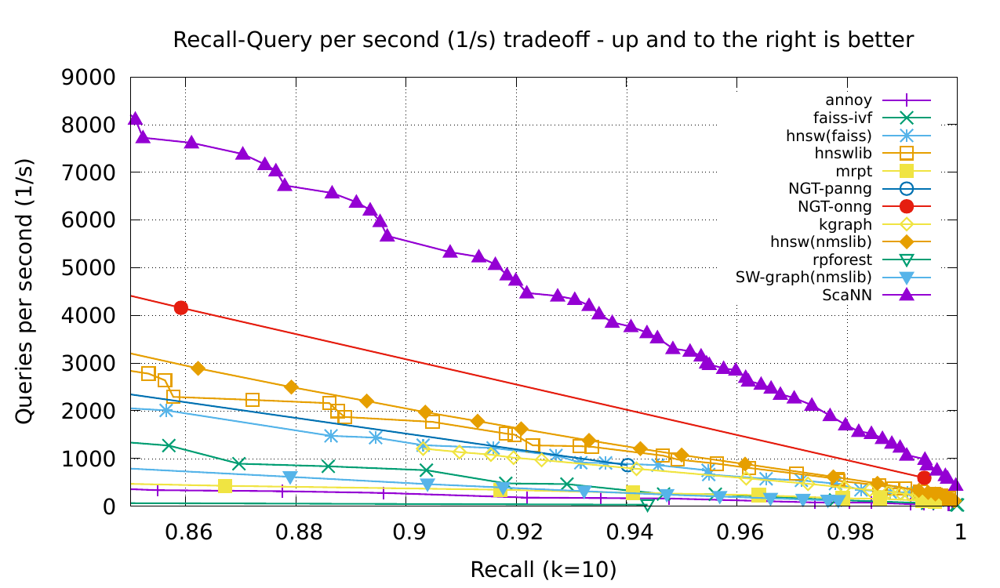

# ScaNN

ScaNN (Scalable Nearest Neighbors) is a method for efficient vector similarity
search at scale. This code release implements [1], which includes search space
pruning and quantization for Maximum Inner Product Search and also supports
other distance functions such as Euclidean distance. The implementation is
designed for x86 processors with AVX2 support. ScaNN achieves state-of-the-art
performance on [ann-benchmarks.com](http://ann-benchmarks.com) as shown on the
glove-100-angular dataset below:



ScaNN can be configured to fit datasets with different sizes and distributions.
It has both TensorFlow and Python APIs. The library shows strong performance
with large datasets [1]. The code is released for research purposes. For more
details on the academic description of algorithms, please see [1].

Reference [1]:
```
@article{
  title={Accelerating Large-Scale Inference with Anisotropic Vector Quantization},
  author={Guo, Ruiqi and Sun, Philip and Lindgren, Erik and Geng, Quan and Simcha, David and Chern, Felix and Kumar, Sanjiv},
  journal={arXiv preprint arXiv:1908.10396},
  year={2020}
}
```

## Python wheels

[Python 3.5](https://storage.googleapis.com/scann/releases/1.0.0/scann-1.0.0-cp35-cp35m-linux_x86_64.whl)
[Python 3.6](https://storage.googleapis.com/scann/releases/1.0.0/scann-1.0.0-cp36-cp36m-linux_x86_64.whl)
[Python 3.7](https://storage.googleapis.com/scann/releases/1.0.0/scann-1.0.0-cp37-cp37m-linux_x86_64.whl)

See [docs/releases.md](docs/releases.md) for previous versions.

## Installation

See above for pre-built binaries compatible with Python 3.5, 3.6, and 3.7 on
Ubuntu 16.04 or later. These binaries can be installed with `pip install <whl
name>`. **These binaries require GLIBCXX 3.4.26 or above, which are included
with GCC 9. Use your operating system's instructions to install GCC 9.**

To build ScaNN from source, first install the build tool Clang 8, and libstdc++ headers for C++17 (which
are provided with GCC 9). Additionally, ScaNN requires a modern version of
Python (3.5.x or later) and Tensorflow 2.1.0 installed on that version of
Python. Once these prerequisites are satisfied, install these dependencies manually:

```
wget https://storage.googleapis.com/scann/abseil-cpp.tar.gz
tar zxvf abseil-cpp.tar.gz
cd abseil-cpp
mkdir build && cd build && cmake .. && make -j8 && make install

wget https://codeload.github.com/protocolbuffers/protobuf/tar.gz/v3.8.0
tar zxvf protobuf-3.8.0.tar.gz
cd protobuf-3.8.0
./augogen.sh && ./configure && make -j8 && make install

wget https://codeload.github.com/google/googletest/tar.gz/release-1.8.1
tar zxvf googletest-release-1.8.1.tar.gz
cd googletest-release-1.8.1
mkdir build && cd build && cmake .. && make -j8 && make install

```

Then compile ScaNN:

```
CXX=clang++-8 CC=clang-8 cmake ..
```

## Usage

See the example in [docs/example.ipynb](docs/example.ipynb). For a more in-depth
explanation of ScaNN techniques, see [docs/algorithms.md](docs/algorithms.md).
